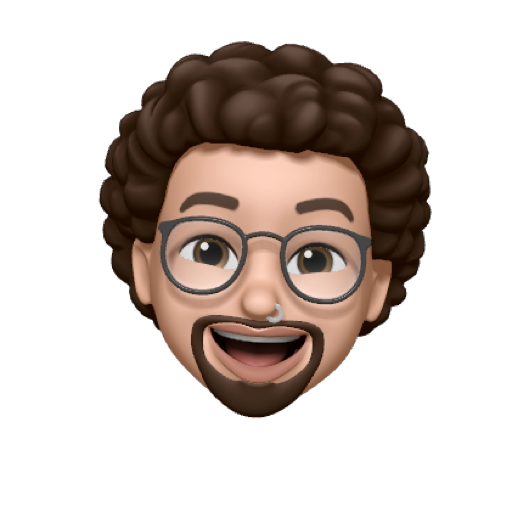

<h1>Raphael Freitas</h1>

 
    Atuando como líder (<a href="https://www.thekua.com/atwork/2019/02/the-trident-model-of-career-development/">Trident Carrer Model</a>) no time de arquitetura de soluções no banco Itaú e com aproximadamente 10 anos de experiência em delivery de software e liderança, contribuo com fortes vieses de qualidade, modernização e ownership na esteira de  desenvolvimento. 

    Com mindset de startup desempenho um papel fundamental na disponibilização e experimentação de funcionalidades estratégicas de negócio com agilidade.
    Formado em Análise de Sistemas e cursando MBA em Data Science e Big Data, me considero um lifelong learner, cultivando e propagando por onde passo o <a href="https://bytesdontbite.com/2010/10/18/o-que-e-software-craftsmanship/">Software Craftsmanship.</a>

  💌 Caso queira entrar em contato ou me seguir no linkedin para ficar por dentro de oportunidades de trabalho e sobre conteudo de tecnologia e liderença: ⤵️

  

  

  

  

  

