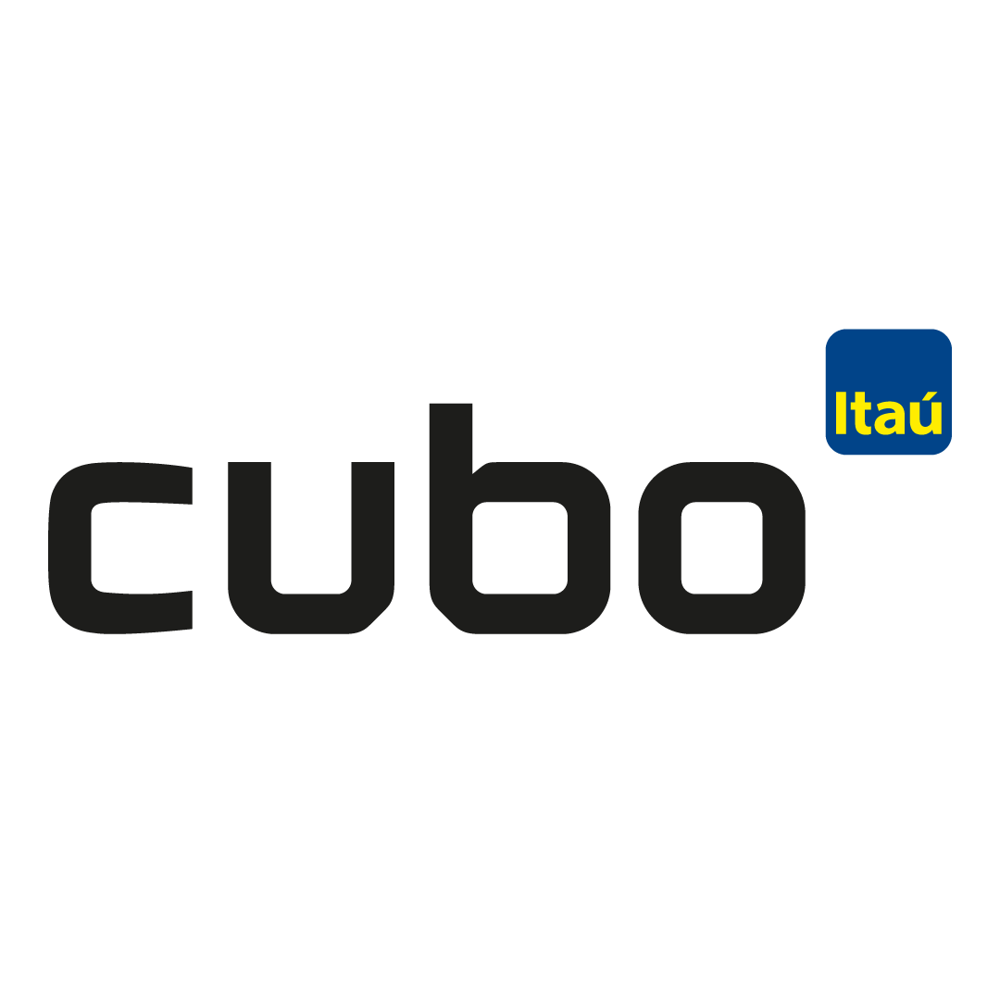
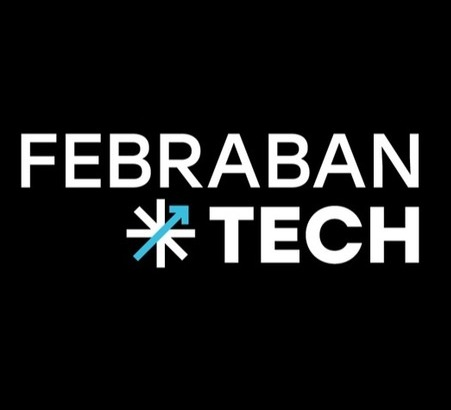
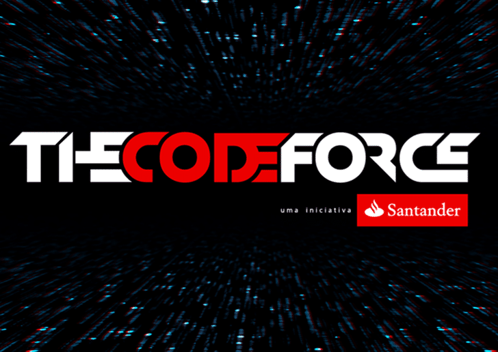
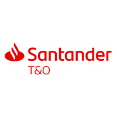
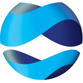

<h1>Raphael Freitas</h1>

 
  Atuando como Líder (<a href="https://www.thekua.com/atwork/2019/02/the-trident-model-of-career-development/">Trident Carrer Model</a>) no time de arquitetura de soluções no banco Itaú e com aproximadamente 10 anos de experiência em delivery de software e liderança, contribuo com fortes vieses de qualidade, modernização e ownership em toda esteira de desenvolvimento. 

  Com mindset de startup e apaixonado por hackthons, desempenho um papel estratégico na disponibilização e experimentação de funcionalidades de negócio com agilidade.
  Formado em Análise de Sistemas e cursando MBA em Data Science e Big Data, me considero um lifelong learner, cultivando e propagando por onde passo o <a href="https://bytesdontbite.com/2010/10/18/o-que-e-software-craftsmanship/">Software Craftsmanship.</a>

 

<h2>🏆 Premiação em Hackthons</h2>

<table>
  
  <tr>
    <td>
      
    </td>
    <td>
      <a href="https://www.hackbrazil.com/"> <b> Harvard & MIT - HackBrazil | Duas Medidas </b> </a>   
      <b> Colocação </b>: Semifinalista  
      <b>Desafio </b>: Resolver grandes problemas Brasileiros através de ideias inovadoras e empreendedoras.   
      <b>Solução </b>: App Duas Medidas - Precificar o produto com relação as regiões e potencial de lucro. 
    </td>
  </tr>
  
  <tr>
    <td>
      
    </td>
    <td>
      <a href="https://revistapegn.globo.com/Startups/noticia/2018/08/3-startups-com-solucoes-inovadoras-para-os-meis.html"> <b> Insights - Itaú | Duas Medidas </b> </a>   
      <b> Colocação </b>: 2º Lugar 
      <b>Desafio </b>: Como ajudar os MEIs a se estabilizarem no mercado de trabalho.   
      <b>Solução </b>: App Duas Medidas - Auxília o(a) empreendedor(a) precificar seu produto.
    </td>
  </tr>

  <tr>
    <td>
      
    </td>
    <td>
      <a href="https://www.febrabantech.com/evento/febrabantech2022"> <b> CIAB - FEBRABAN | PliwWallet </b> </a>   
      <b> Colocação </b>: 3º Lugar  
      <b>Desafio </b>: Como Melhorar o onboarding de clientes nas instituições financeiras.   
      <b>Solução </b>: pp PlimWallet - Carteira digital de documentos baseado na tecnologia Blockchain.
    </td>
  </tr>

  <tr>
    <td>
      
    </td>
    <td>
      <a href="https://www.conexaofintech.com.br/fintech/banco-santander-code-force/"> <b> The Code Force - Santander | Passless Payment </b></a>  
      <b>Colocação </b>: 3º Lugar  
      <b>Desafio </b>: Como Melhorar Melhorar as formas de pagamento nas instituições financeiras.   
      <b>Solução </b>: App Passless - Provedor de pagamento sem a necessidade de cartão. 
    </td>
  </tr>

</table>

 

<h2>🤓 Contribuições e Aprendizados</h2>

<h3>Alta Disponibilidade</h3>

 &nbsp; 
 &nbsp; 
 &nbsp; 

<h3>Blockchain</h3>

 &nbsp; 
 &nbsp; 
 &nbsp; 

<h3>Testes</h3>

 &nbsp; 
 &nbsp; 

<h3>IOS</h3>

 &nbsp; 
 &nbsp; 
 &nbsp; 

<h3>Esse Site</h3>

 &nbsp; 

<!--
<h2>👔 Experiência de Trabalho</h2>

 
&nbsp; **Especialista II** \
&nbsp; [**Banco Safra**](https://www.safra.com.br/) • _Full-time_ \
&nbsp; **Linguagens & Tecnologias**: `C#, .NET Core 3.1, Polly, NUnit, Moq, Cucumber, JMeter, Git (Git Flow), Jeckins, Sonar, Fortfy, MongoDB, Oracle, Kafka, OpenShift (PAAS). ` \
&nbsp; **Projetos em destaque**: [Open Banking - Fase I](https://openbanking-brasil.github.io/areadesenvolvedor/#fase-1-apis-do-open-banking-brasil) e [Fase II](https://openbanking-brasil.github.io/areadesenvolvedor/#fase-2-apis-do-open-banking-brasil)

&nbsp; **Especialista I** \
&nbsp; [**Banco Santander**](https://www.santander.com.br/) • _Full-time_  \
&nbsp; **Linguagens & Tecnologias**: `Java 11, Spring Boot, UniRest, Resilience4J, JUnit, Mockito, Cucumber, Fluent Assertation, Maven, TypeScript, JMeter, Git (Trunk Based Development e Git Flow), Jeckins, MongoDB, SQLServer, Kafka, OpenShift `\
&nbsp; **Projetos em destaque**: [PIX (SX) – Canais PJ](https://www.santander.com.br/banco/sx) e [Pagamento em Lote](https://www.santander.com.br/servicos-financeiros/solucoes-de-pagamento/pagamento-a-fornecedores)

&nbsp; **Arquiteto de Soluções** \
&nbsp; [**Banco Itaú**](https://www.itau.com.br/) • _Full-time_  \
&nbsp; **Linguagens & Tecnologias**: `Java 8, Spring Boot, C#, .NET Core 3.1, Piloto API Moedas PAAS`\
&nbsp; **Projetos em destaque**: [Riscos e Capital](#) e [Prevenção a Fraudes e Lavagem de Dinheiro](#)

&nbsp; **Desenvolvedor Full Stack Sênior | Tech Lead** \
&nbsp; [**Netshoes**](https://www.netshoes.com.br/) • _Full-time_  \
&nbsp; **Linguagens & Tecnologias**: `Java 8, Spring Boot, Spock, JUnit, Mockito, Maven, TypeScript, JMeter, Git (Trunk Based Development), Jeckins, MongoDB, Cassandra, Kafka `\
&nbsp; **Projetos em destaque**: [Home da Copa 2018 - Teste A/B](#) e [Continuar Comprando - Teste A/B](#)

&nbsp; **Especialista | Tech Lead** \
&nbsp; [**Accenture - Santander**](https://www.accenture.com/) • _Full-time_  \
&nbsp; **Linguagens & Tecnologias**: `Java 8, Spring Boot, UniRest, Resilience4J, JUnit, Mockito, Cucumber, AssertJ Fluent Assertation, Gson, Java Money, Maven e JMeter (Stress Testing), Javascript, Typescript e PL/SQL,  NodeJS, Angular, Nest.JS, JestJS, Seleniume, Jasmine, D3, RxJS, NGRX, Git (Git Flow), Jeckins, Sonar, Fortfy, Oracle, SQLServer, OpenShift (PAAS)`\
&nbsp; **Projetos em destaque**: [Novo Portal de Negócios Internacionais](https://www.santander.com.br/comercio-exterior-e-cambio/portal-de-negocios-internacionais) e [Reestruturação da Arquitetura da Tesouraria](#)

&nbsp; **Desenvolvedor Full Stack** \
&nbsp; [**Peterson | Control Union**](https://www.petersoncontrolunion.com/) • _Desenvolvedor Full Stack_  \
&nbsp; **Linguagens & Tecnologias**: `AspNet 3.0, Visual Basic, Java 8, AngularJS, Angular, Grunt, Gulp, Spring Boot, JPA, Hibernate, Rest Assured, JUnit, Mockito, Cucumber, Maven e JMeter (Stress Testing), Mercurial e Git (Git Flow), SQLServer, H2Console. `\
&nbsp; **Projetos em destaque**: [Ports Division](https://commoditylogistics.onepeterson.com/en) e [Certifications](https://certifications.controlunion.com/en)

 

<h2> Github Profile Trophy </h2>

 
-->
<h2>Contatos </h2>

💌 Caso queira entrar em contato ou me seguir no linkedin para ficar por dentro de oportunidades de trabalho e sobre conteudo de tecnologia e liderença: ⤵️

  

  

  

  

  

  

